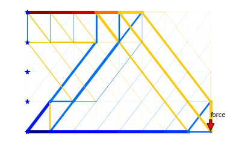

# 2D_topo_opt_truss_structure
As an academic project, I developed a 2D topology optimization of a truss structure in python, the algorithm took and performed many examples available in the web. The topology optimization was done under the nested formulation, It means that the process is static. Many examples of this problem have been done, however, this is able to analyze structures of any size, and shows a nice visualization with VTK library and Matplotlib. I hope this work could be useful for you.

Five functions were implemented and/or modified in order to accomplish the process, being inspired mostly by the codes proposed in the book of (Ferreira, 2009):

- _structure2_ Build the element matrix in an array, containing the coordinates in each element.
- _indexation_ Returns the element matrix but with the node indexation.
- _solution_ Function to find solution in terms of global displacements. The code was based on the book of AJM Ferreira \cite{Codes2009}
- _formStiffness2Dtruss_ Build the Stiffness matrix of the entire problem.
- _outputDisplacementsReactions_ Calculates the force reactions once the displacements are obtained.
- _stresses2Dtruss_ Calculates the stresses in each element.

Another class was proposed for visualizing the answer, which are:

- _displayTruss:_     Function for calculating stiffness matrix, displacements, stresses of 2D trusses
    with the VTK libraries. Original code proposed by \cite{truss2015}.
- _visualizeAreas:_ A function to plot the results in terms of areas (width of the line) and in terms of Stresses (Blue is compression, red is tension).

Now, we are ready to execute the code as follows:

<b> Caption: </b> Topology Opt. of a 2D truss Structure at 51 iterations.

<b> Caption: </b> Topology Opt. of a 2D truss Structure at 206 iterations.

